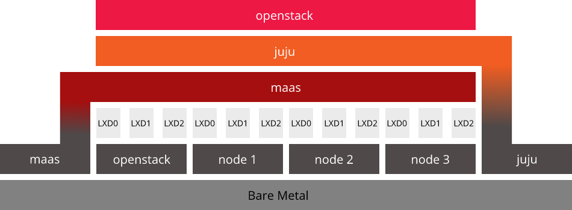
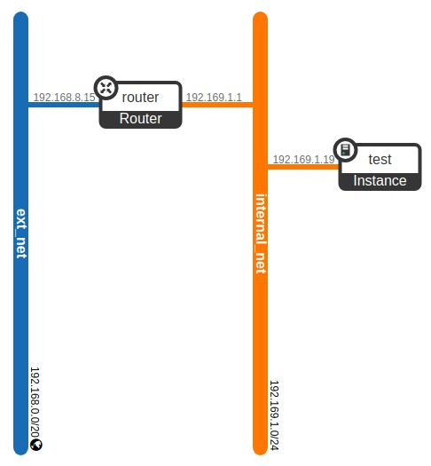
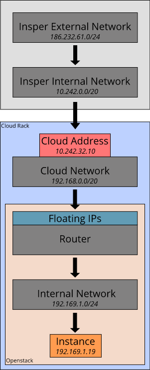

# Cap. 3 - Private Cloud Stack - 4 Aulas
### Hugo Mendes e Martim José
## Instalando Canonical Distro:
Para baixar o charm do Openstack:
* `wget https://api.jujucharms.com/charmstore/v5/openstack-base/archive`
* `unzip archive`

Escolhemos começar um controller novo:
* `juju kill-controller`
* `juju bootstrap maas main --to juju`

Instalando o bundle customizado:
* `juju deploy bundle.yaml`

Instalando o client do Openstack:
* `sudo apt  install python3-openstackclient`
* `sudo apt install python-novaclient python-keystoneclient python-glanceclient python-neutronclient python-openstackclient -y` (instala as ferramentas necessárias para o client)

Para criar as variáveis do ambiente:
* `cd ~openstack` (diretório onde o charm foi extraído)
* `source openrc`
* `env` (imprime as variáveis de ambiente)
* `openstack catalog list` (lista os serviços)

#### 1. Faça um desenho de como é a sua arquitetura de solução, destacando o hardware, sistema operacional/container e respectivas alocações dos serviços.


## Configurando o Openstack (https://jujucharms.com/openstack-base/)
Para importar a imagem do Ubuntu 16:
```
curl http://cloud-images.ubuntu.com/xenial/current/xenial-server-cloudimg-amd64-disk1.img | \
    openstack image create --public --container-format=bare --disk-format=qcow2 xenial
```

Para importar a imagem do Ubuntu 18:
```
curl http://cloud-images.ubuntu.com/bionic/current/bionic-server-cloudimg-amd64.img  | \
    openstack image create --public --container-format=bare --disk-format=qcow2 bionic
```

Para configurar uma rede "externa" e roteador compartilhado (na pasta openstack):
```
./neutron-ext-net-ksv3 --network-type flat -g 192.168.0.1 -c 192.168.0.0/20 -f 192.168.8.1:192.168.9.254 ext_net
```

Para configurar a rede interna (na pasta openstack):
```
./neutron-tenant-net-ksv3 -p admin -r provider-router -N 1.1.1.1 internal 192.169.1.0/24
```

Para configurar os flavors (instance type):
* openstack flavor create --ram <size-mb> --disk <size-gb> --ephemeral-disk <size-gb> --vcpus <num-cpu> <flavor-name>

* `openstack flavor create --ram 1024 --disk 20 --ephemeral 0 --vcpus 1 m1.tiny`
* `openstack flavor create --ram 2048 --disk 20 --ephemeral 0 --vcpus 1 m1.small`
* `openstack flavor create --ram 4096 --disk 40 --ephemeral 0 --vcpus 2 m1.medium`
* `openstack flavor create --ram 8192 --disk 40 --ephemeral 0 --vcpus 4 m1.large`

Para criar um Key-pair usando a *public key* do próprio MaaS:
* `openstack keypair create --public-key ~/.ssh/id_rsa.pub mykey`

(O ideal era ter uma keypair para cada instância, mas como estamos em um ambiente controlado, podemos fazer assim. De modo que o MaaS consiga acessar todas as instâncias com uma chave só.)

Via o comando `juju status` é possível ver que a Dashboard é acessível pelo ip *192.168.1.30*. Para acessar remotamente, foi feito um port foward no roteador:
* 10.242.32.10:80 => 192.168.1.30:80
* 10.242.32.10/horizon

Os dados de login da dashboard estão nas variáveis `env`:
* domain: admin_domain -> [OS_USER_DOMAIN_NAME]
* username: admin -> [OS_USERNAME] 
* senha: [OS_PASSWORD]

Para liberar o acesso SSH, ICMP e DNS:
* Project > Network > Security Groups > Default - Manage Rules
* Para cada nova regra: Add Rule > Rule [SSH, ICMP, DNS] > Add (0.0.0.0/0 para todos os IPs)
  
Para disparar uma instância tiny sem volume adicional:
* http://10.242.32.10/horizon/project/instances/
* Source > Delete Volume on Instance delete: `No`
* Source > Allocated: `Bionic`
* Network > Alocated: in_net
* Flavor: m1.tiny
* Key Pair > Create Key Pair: MyKey
  
Para alocar um IP flutuante para instância:
* Instance (em questão) > Associate Floating IP
* Crie o IP (+) e associe à instância
* Floating IP associado: `192.168.8.1`
  
Assim, o IP interno da instância na rede openstack (*192.169.1.0/24*) é *192.169.1.19*. Estando na rede externa (*192.168.0.0/20*), é possível conectar na rede interna por meio de um roteador e acessar a instância criada. O esquema pode ser visto abaixo:


Para testar a conexão SSH, podemos conectar na rede interna *192.168.0.0/20* e depois na instância criada (que está na rede interna do Openstack), por meio de:
* `ssh cloud@10.242.32.10`
* `ssh ubuntu@192.168.8.1` (floating IP)

#### 2. Faça um desenho de como é a sua arquitetura de rede, desde a conexão com o Insper até a instância alocada.


## Criando usuários

A interface para criar um usuário e um projeto:
* Identity > Users > Create User

Para testar a conexão SSH com a instância, foi preciso transferir a private key pair para a máquina cloud:
* `scp Downloads/keypairmartim.pem scp://cloud@10.242.32.10//home/cloud/martimfjkeypair.pem`

Para conectar na instância pela máquina Cloud:
* chmod 400 martimfjfjkeypair.pem
* ssh ubuntu@192.168.8.12 -i martimfjkeypair.pem

#### 3. Monte um passo a passo de configuração de rede via Horizon.
Network > Network Topology > Create Network
* Network Name: `intnet_martim`
* Subnet Name: `subnet_martim`
* Network Address: `192.171.0.0/24`
* Allocation Pools: `192.171.0.3, 192.171.0.254`
* DNS Name Servers: 
``` 
192.171.0.2
192.168.0.3
8.8.8.8
```

Network > Network Topology > Create Router
* Router Name: `router_martim`
* External Network: `ext_net`

Clique no roteador e adicione uma interface:
* Subnet: `intnet_martim: 192.171.0.0/24`
* IP Address: `192.171.0.1`

## Protótipo II
* Hugo Mendes: (repositório git)
* Martim José: https://github.com/martimfj/openstack_shadeapp

## Deja-vu (Juju Reborn)
#### 4. Escreva as configurações utilizadas para incluir o Openstack como Cloud Provider no Juju.

Para acessar a instância *test* criada no início do roteiro:
* `ssh ubuntu@192.168.8.1`

Instalando o juju e o juju-gui:
* `apt install python-software-properties`
* `sudo add-apt-repository ppa:juju/stable`
* `sudo apt-get update && sudo apt-get install`
* `juju-core`
* `juju generate-config`

Adicionando o Openstack como *Cloud Provider* no Juju:
* `juju add-cloud maas ~/.local/share/juju/clouds.yaml`

Para instalar o Kubernetes core, acesse a máquina criada via SSH:
* `juju deploy kubernetes-core`

Para testar: https://jujucharms.com/kubernetes-core/
Entrar no dashborad: Interacting with the Kubernetes cluster

#### 5. Escreva o comando de bootstrap.


## Escalando o Kubernetes
#### 6. O que é um Hypervisor? Qual o hypervisor do Openstack, da AWS e da Azure?


## Habilitando o LoadBalancer
#### 7. Escreva o seu roteiro detalhado de instalação e testes


## Questões Complementares
#### 1. Assistir o vídeo: https://youtu.be/ZlCoIIgLzYQ

#### 2. Dado que vocês trabalharam com Nuvem Pública e com Nuvem Privada, descreva com detalhes como você montaria uma Nuvem Híbrida. Como seria a troca de dados?

#### 3. É possível somar todo o hardware disponível e disparar uma instância gigante (ex: mais memória do que disponível na melhor máquina)? Discorra sobre as possibilidades.

#### 4. Como visto é possível rodar o Juju sobre o Openstack e o Openstack sobre o Juju. Quais os empecilhos de ter um Openstack rodando sobre outro Openstack?


## Concluindo
#### 1. Cite e explique pelo menos 2 circunstâncias em que a Private Cloud é mais vantajosa que a Public Cloud.

#### 2. Openstack é um Sistema Operacional? Descreva seu propósito e cite as principais distribuições?

#### 3. Quais são os principais componentes dentro do Openstack? Descreva brevemente suas funcionalidades.

#### Conclusão: A arquitetura em núvem permite diminuir o disperdício de hardware e ganho na mobilidade de recursos. Contudo existem sérios riscos que podem paralizar as operações de uma empresa. Todo equipamento e arquiteturas complexas são passíveis de falhas tanto operacionais quanto de segurança. Como seria possível mitigar esses riscos?
